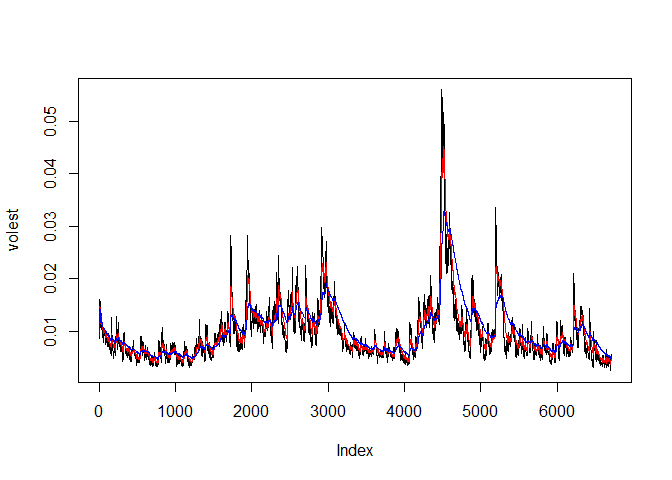

# 11
Murtada Shubbar  
August 17, 2017  
knitr::opts_chunk$set(echo = TRUE) 

##install.packages("tseries")


```r
library(tseries)
```

```
## Warning: package 'tseries' was built under R version 3.4.1
```

```r
##data input
SandPIn <- get.hist.quote('^gspc',quote="Close")
```

```
## 'getSymbols' currently uses auto.assign=TRUE by default, but will
## use auto.assign=FALSE in 0.5-0. You will still be able to use
## 'loadSymbols' to automatically load data. getOption("getSymbols.env")
## and getOption("getSymbols.auto.assign") will still be checked for
## alternate defaults.
## 
## This message is shown once per session and may be disabled by setting 
## options("getSymbols.warning4.0"=FALSE). See ?getSymbols for details.
```

```
## 
## WARNING: There have been significant changes to Yahoo Finance data.
## Please see the Warning section of '?getSymbols.yahoo' for details.
## 
## This message is shown once per session and may be disabled by setting
## options("getSymbols.yahoo.warning"=FALSE).
```

```
## time series ends   2017-08-15
```

```r
##log data
SandPLog <- log(lag(SandPIn)) - log(SandPIn)


##Volatility measure 
SNPvol <- sd(SandPLog) * sqrt(250) * 100


##loop

Vol <- function(d, logrets)
{
  
  var = 0
  
  lam = 0
  
  varlist <- c()
  
  for (r in logrets) {
    
    lam = lam*(1 - 1/d) + 1
    
    var = (1 - 1/lam)*var + (1/lam)*r^2
    
    varlist <- c(varlist, var)
    
  }
  
  sqrt(varlist)
}


#Plotting  

volest <- Vol(10,SandPLog)
volest2 <- Vol(30,SandPLog)
volest3 <- Vol(100,SandPLog)
```


```r
plot(volest,type="l")

lines(volest2,type="l",col="red")

lines(volest3, type = "l", col="blue")
```

<!-- -->


